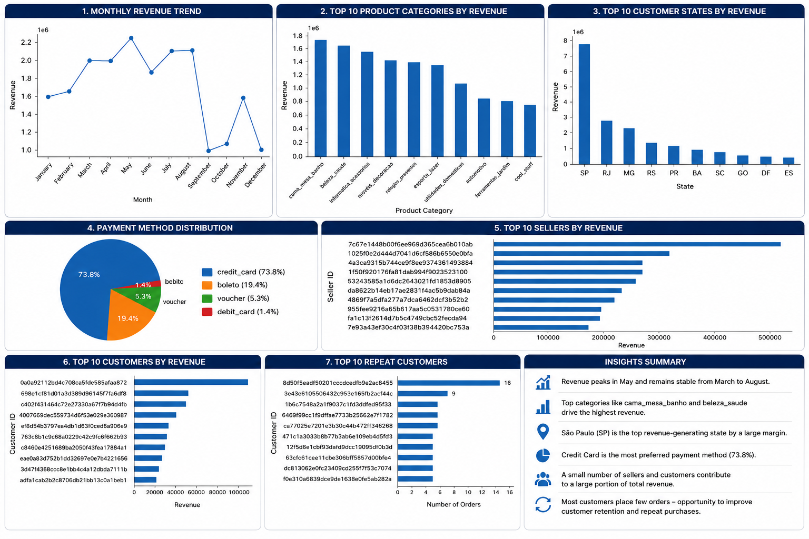

# 📊 Customer Analytics Dashboard


An end-to-end **Customer Analytics** project built using **SQL, Python, Pandas, Plotly, and Streamlit** to analyze customer purchasing behavior, product performance, seller performance, payment trends, and regional sales insights using the Brazilian E-Commerce (Olist) dataset.

This project demonstrates a complete Data Analytics workflow—from raw transactional data to an interactive dashboard that supports data-driven business decisions.

---

# 📌 Project Overview

The objective of this project is to analyze customer purchasing patterns and business performance to uncover actionable insights for decision-makers.

The project focuses on:

- Customer purchasing behavior
- Revenue analysis
- Product performance
- Seller performance
- Payment preferences
- Geographical sales distribution
- Repeat customer analysis
- Interactive business dashboard

---

# 🎯 Business Problem

An e-commerce company wants to understand:

- Which customers generate the highest revenue?
- Which product categories perform best?
- Which sellers contribute the most sales?
- Which states generate the highest revenue?
- Which payment methods are preferred?
- How revenue changes throughout the year?
- Which customers make repeat purchases?

The objective is to transform raw transactional data into meaningful business insights that support strategic decision-making.

---

# 🛠️ Tech Stack

- **SQL (MySQL)** – Business Analysis
- **Python** – Data Cleaning & Analysis
- **Pandas** – Data Manipulation
- **Plotly** – Interactive Visualizations
- **Streamlit** – Dashboard Development
- **Git & GitHub** – Version Control

---

# 📂 Project Structure

```
Customer-Analytics-E-Commerce
│
├── app.py
├── requirements.txt
├── README.md
├── LICENSE
│
├── Data
│   └── customer_analytics_sample.csv
│
├── Images
│   ├── python_eda_dashboard.png
│   ├── streamlit_dashboard.png
│   ├── streamlit_dashboard (1).png
│   ├── streamlit_dashboard (2).png
│   └── streamlit_dashboard (3).png
│
├── Python
│   └── Customer_Analytics_EDA.ipynb
│
└── SQL
    └── Customer_Analytics_SQL.sql
```

---

# 🔄 Analytics Workflow

1. Import Dataset
2. Data Exploration
3. Data Quality Assessment
4. Data Cleaning
5. Data Integration
6. Feature Engineering
7. Exploratory Data Analysis (EDA)
8. SQL Business Analysis
9. Interactive Dashboard Development
10. Business Insights
11. Dashboard Deployment

---

# 📌 Business Questions Answered

- Which customer states generate the highest revenue?
- Which product categories contribute the most revenue?
- Who are the top-performing sellers?
- Who are the highest-value customers?
- Which payment methods are most frequently used?
- What are the monthly revenue trends?
- Which customers place repeat orders?
- Which product categories should the business prioritize?

---

# 📊 Dashboard Features

### 📈 Monthly Revenue Trend

Visualizes monthly revenue trends to identify seasonal sales patterns.

---

### 🛒 Product Category Analysis

Shows the highest revenue-generating product categories.

---

### 🌍 Customer State Analysis

Analyzes revenue distribution across customer states.

---

### 💳 Payment Method Distribution

Shows customer payment preferences using an interactive pie chart.

---

### 🏆 Top Sellers

Ranks sellers by total revenue generated.

---

### 👥 Top Customers

Identifies the highest-value customers.

---

### 🔄 Repeat Customers

Highlights customers with the highest purchase frequency.

---

# 📈 Key Performance Indicators (KPIs)

- 💰 Total Revenue
- 📦 Total Orders
- 👥 Total Customers
- 🛒 Average Order Value
- 📈 Monthly Revenue Trend
- 🛍️ Top Product Categories
- 🌎 Customer State Revenue
- 💳 Payment Distribution
- 🏆 Top Sellers
- 👤 Top Customers

---

# 🎯 Skills Demonstrated

### SQL

- Joins
- Aggregate Functions
- GROUP BY
- ORDER BY
- Window Functions
- Common Table Expressions (CTEs)
- Business Query Writing

### Python

- Pandas
- Data Cleaning
- Feature Engineering
- Data Manipulation
- Exploratory Data Analysis

### Data Visualization

- Plotly
- Streamlit Dashboard
- Business KPI Design

### Business Analytics

- Customer Analytics
- Revenue Analysis
- Product Performance
- Seller Performance
- Payment Analysis
- Business Storytelling

---

# 💡 Key Business Insights

- Revenue exhibits noticeable monthly fluctuations, indicating seasonal demand patterns.
- A small number of product categories contribute a large share of overall revenue.
- Credit Card is the dominant customer payment method.
- Revenue is concentrated within a limited number of customer states.
- A relatively small group of sellers generates a significant percentage of total sales.
- High-value customers contribute disproportionately to total revenue.
- Repeat customers represent valuable opportunities for loyalty and retention initiatives.

---

# ⭐ Business Story

An e-commerce company wanted to better understand customer purchasing behavior and identify the key drivers of revenue growth.

Using SQL and Python, raw transactional data was cleaned, transformed, and analyzed to uncover business insights. The processed data was then presented through an interactive Streamlit dashboard that allows stakeholders to monitor KPIs, explore sales trends, evaluate seller performance, analyze customer behavior, and identify high-performing products.

This project demonstrates how raw business data can be converted into meaningful insights that support informed decision-making.

---

# 🖥️ Dashboard Preview

## Python EDA Dashboard



---

## Streamlit Dashboard

.png)

.png)

.png)

---

# 📂 Dataset

This project is based on the **Brazilian E-Commerce Public Dataset by Olist**.

The original dataset is not included in this repository because it exceeds GitHub's file size limit.

A sample dataset is included for demonstration purposes.

---

# 🚀 Future Improvements

- Customer Lifetime Value (CLV)
- RFM Customer Segmentation
- Customer Churn Prediction
- Sales Forecasting
- Product Recommendation System
- Profitability Analysis
- Real-Time Data Integration

---

# 🌐 Live Dashboard

> **Coming Soon** *(Will be updated after deployment on Streamlit Community Cloud.)*

---

# 👨‍💻 Author

**Sameer Sharma**

**Aspiring Data Analyst**

### Skills

- SQL
- Python
- Excel
- Power BI
- Streamlit
- Git
- GitHub

---

# ⭐ Project Summary

This project showcases a complete end-to-end Customer Analytics workflow using industry-standard data analytics tools.

Starting from raw transactional data, the project performs SQL-based business analysis, Python data preprocessing, exploratory data analysis, interactive dashboard development, and business storytelling to generate actionable insights for decision-makers.

The project highlights practical skills expected from an entry-level Data Analyst, including SQL querying, data cleaning, data visualization, dashboard development, and business insight generation.

---

## ⭐ If you found this project helpful, consider giving it a Star!
